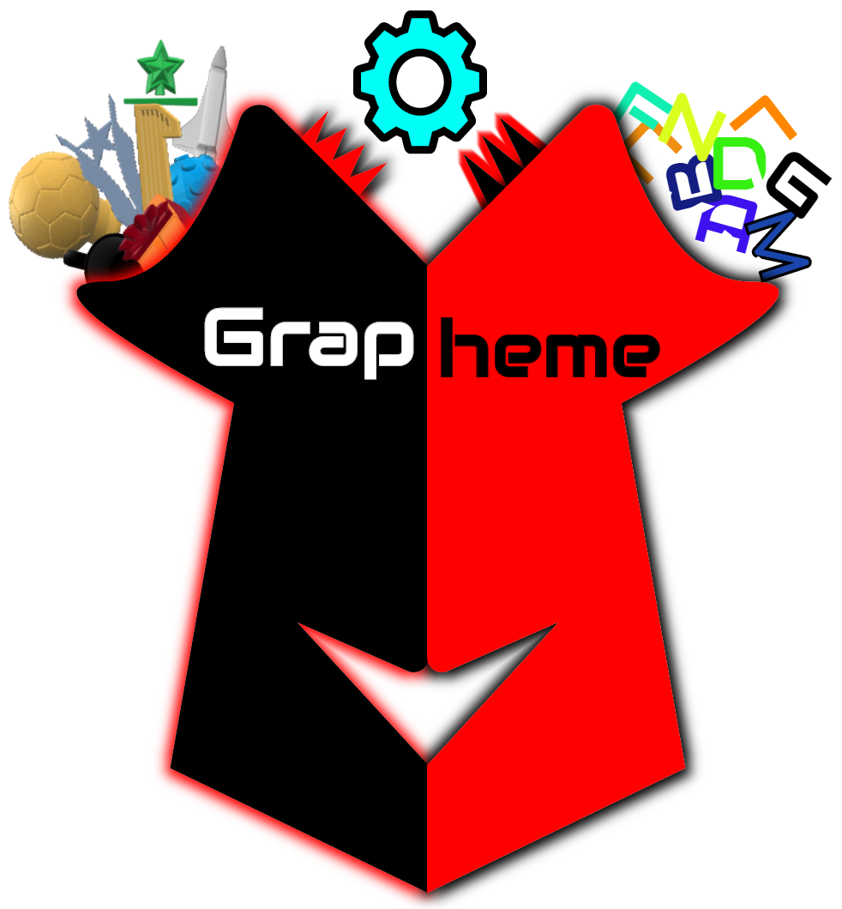

<!-- 
an innovative augmented reality game that stimulates the mind
 -->

  

# Content 
[Introduction](#Introduction)
<!-- 1.1 Objective
2.0 Technology Review
2.1 Open Source Libraries Litirature Review
2.2 AR Games Development 
2.3 Game Engines In Contrast With AR Litiriture Review
3.0 Game Designs Imparted with AR
3.1 My Game Concept
3.2 Game Modes
3.3 Game Rules & Elements
3.3 Platform -->

# Introduction
	Humans excell at so many evoloutionary developments and making the computers size smaller with processing power much faster was just the start towards one of the
	greatest worlds ever, games world.
	Today, games lead the human entertainment platform of different ages, with high-end graphics and defintion games or Virtual Reality games that emerges the player in a completely new surrounding.
	So, whats next humans?, the answer is Augmented Reality, the exciting relatively new technology that augments virtual elements onto an excisting real-time physical elements.
	This technology requires nothing more than higher than avereage proccessor power, camera, display, and a supported platform, ever heard of Pokemon GO?.

1.1 Objective
	The objective that was assigned to me is to build an AR game that concludes my own game design, concept and development.

2.0 Technology Review
	At the moment its very compenhansive to grasp all the bits and pieces to develop an application in that framework, never the less, some of the open source 
	libraries have made this computer vision and imagery proccess easier for the rest of us.

2.1 Open Source Libraries Litirature Review
	ARtoolkit , IN2AR , Qualcomm and ...

2.3 Game Engines In Contrast With AR Litiriture Review
	Unity3D has a direct connection with ARToolkit via free packages which makes it easier to just start development with Unity3D instead of Unreal Engine which also
	got a direct pluging from ARToolkit but for 99$ so, although, the engine is free to download and use but payment must be done to develop an AR game whichautomatically
	droops it out of the choices list.

3.0 Game Designs Imparted with AR
	Majority of the games in this field requires interaction with the environment of the player with or without some predefined	images [markers], GPS locations and/or 
	sounds, so making games in that sense has to be a little bit over creative standards.

3.1 My Game Concept 
	A memory game based on cards where the exciting part lies on how fast the player connects english letters with cards that represent those letters (i.e: a picture of car is the letter 'A').
 	And in the same sense, the player maybe given a set of cards that represent a word and voice recognition will be used to confirm player's answer.

3.2 Game Modes
	- Solo : ( collect 100 stars to finish a difficulity level)
		- Frog (Easy)  : Player will be asked to form/pronounce words of 3 - 6 letters.
		- Ant (Medium) : Player will be asked to form/pronounce words of 6 letters minimum.
		- Pigeon (Hard): Player will be asked to form/pronounce sentences of 2 - 4 words.
		- Human (Intelligent): Player will be asked to form/pronounce sentences of 4 words minimum.

	- Head To Head :
		- Form Cards :
			# Input : Maximum number of words Min (3).
			# Input : Maximum number of sentences (Min 0).
			# Input : Timer on/off.
			# Input : Difficulity (Frog - Human)

		- Pronounce Words :
			# Input : Maximum number of words Min (3).
			# Input : Maximum number of sentences (Min 0).
			# Input : Timer on/off.
			# Input : Difficulity (Frog - Human).

		- Feeling Intelligent :
			# Randomized set of challenges.

	- Group vs Group : (May or may not be implemented depending on time)
		- Choose number of team members (Min 2).
		- Pick a number up (If Min then 1 or 2).
		- Randomized gameplay.
		- Every player will be given parts of the words/sentences to form/pronounce.

3.3 Game Rules & Elements

	Rules :
	- For each correct answer the player wins 1 star, maximum of 3 stars can be won depending on how fast the player forms/pronounces the letter. 
	- Every 9 stars the player gets a "Hint" helper.
	- If "Hint" is available, then it can be used by tapping on the card.
	- Player has to organize the cards from left to right to represent the given word.
	- Player has to pronounce the word represented by the cards correctly.
	- A "Timer" will be used in Head To Head or Group gameplay.

	Elements :
	- Physical Cards.
	- English words.
	- Voice recognition.
	- Leaderboard.
	- Timer.

 3.4 Platform & Device Specs
 	- Android.
 	- Kitkat 4.6 (API 19).
 	- Quad Core chip-set processor.

*********************************************** Trials *******************************************
- Natural Feature Tracking is used with images that are not easy to build as bordered markers.
- Building NFT images depends on training the camera on few images.
- Creating texture data(pattern) is easier because the generation of the data text file goes through both training and generating data files of a printed black bordered image.
 
